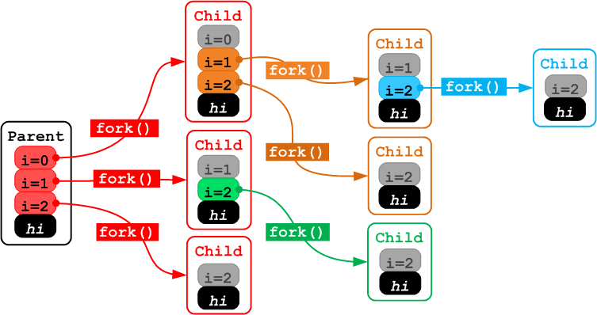

## Section 2

### 3.1 Forks
How many new processes are created in the below program?

```c
int main(void) {
    for (int i = 0; i < 3; i++) {
        pid_t pid = fork();
    }
}
```
Answer: 7, (8 including the original process)


### 3.2 Stack Allocation

What can C print?

```c
int main(void) {
    int stuff = 7;
    pid_t pid = fork();
    printf("Stuff is %d\n", stuff);
    if (pid == 0)
        stuff = 6;
}
```
Answer: 
since the entire address space is copied stuff will still remain the same
```
stuff is 7 // output by parent process
stuff is 7 // output by child process
```

### 3.3 Heap Allocation

```c
int main(void) {
    int* stuff = malloc(sizeof(int)*1);
    *stuff = 7; // set content of that address as 7
    pid_t pid = fork();
    printf("Stuff is %d\n", *stuff);
    if (pid == 0)
        *stuff = 6
}
```
since the entire address space is copied stuff will still remain the same

Answer: 
```
stuff is 7 // output by parent process
stuff is 7 // output by child process
```

### 3.4 Slightly More Complex Heap Allocation
what does C print in this case?


```c
void printTenNumbers(int *arr) {
    int i;
    printf("\n");
    for(i = 0; i < 10; i++) {
        printf("arr %d is %d\n",  i, arr[i]);
    }
    exit(0);
}

int main() {
    int *arr, i;
    arr = (int *) malloc (sizeof(int));

    arr[0] = 0;
    for(i = 1; i < 10; i++) {
        arr = (int *) realloc( arr, (i + 1) * sizeof(int));
        arr[i] = i;
        if (i == 7) {
            pid_t pid = fork();
            if (pid == 0) {
                printTenNumbers(arr);
            }
        }
    }
    printTenNumbers(arr);

}
```

output is 

01234567 (possibe segmentfault) for child, because the array was not allocated to hold 10 integers when `fork()` was called.
0123456789 for parent.

### 3.5 Simple Wait

What can C print? Assume the child PID is 90210
```c

int main(void) {
    pid_t pid = fork();
    int exit;
    // if (pid != 0) {
    //     wait(&exit);
    // }
    printf("Hello world\n: %d\n", pid);
}

// output
// Hello world
// : 31970
// Hello world
// : 0

int main(void) {
    pid_t pid = fork();
    int exit;
    if (pid != 0) {
        wait(&exit);
    }
    printf("Hello world\n: %d\n", pid);
}

// output
// Hello world
// : 0
// Hello world
// : 31928
```
and equivalent `waitpid` is 

```c
int main(void) {
    pid_t pid = fork();
    int exit;
    if (pid > 0) {
        waitpid(pid, &exit, 0);
    }
    printf("Hello world\n: %d\n", pid);
}
```

### 3.6 Fork and File Descriptors
What will be stored in the file "output.txt" ?

```c
int main(void) {
    int fd;
    fd = open("output.txt", O_CREATE|O_TRUNC|O_WRONLY, 0666);

    if (!fork()) {
        write(fd, "hello ", 6);
    } else {
        int status;

        wait(&status);
        write(fd, "world\n", 6);
    }
}
```
write to file using multi processeas
File descriptors are copied and point to the same underlying file sctructure in the kernel's open file table.

if current process is child process, write "hello".
if parent process, wait child process to complete, and write "world"

### 3.7 Exec
What will C print?

```c
int main(void) {
    char** argv = (char**) malloc(3*sizeof(char*));
    argv[0] = "bin/ls";
    argv[1] = ".";
    argv[2] = NULL;
    for (int i = 0; i < 10; i++) {
        printf("%d\n", i);
        if (i == 3)
            execv("/bin/ls", argv);
    }
}
```

### 3.8 Exec + Fork 
How would I modify the above program using fork so it both prints the output of ls and all the numbers from 0 to 9(order does not matter)? You may not remove lines from the original programl only add statements(and use fork!o

```c
int main(void) {
    char** argv = (char**) malloc(3*sizeof(char*));
    argv[0] = "bin/ls";
    argv[1] = ".";
    argv[2] = NULL;
    for (int i = 0; i < 10; i++) {
        printf("%d\n", i);
        if (i == 3) {
            pid_t pid = fork();
            if (pid == 0)
                execv("/bin/ls", argv);
        }
            
    }
}
```


### 3.9 Implementing fork() efficiently (Design)
Remember fork() makes the child process's address space exactly the same as its parent's. If you were designing an OS, list some steps you would take to make this address space copy more efficiento?

1. Program calls `fork()` system call
2. Kernal fork system call duplicates the process running the program
3. The kernel sets the return value for the system call for the original program and for the duplicate (PID of the duplicate and 0, respectively)
4. The kernel puts both processes in the scheduler queue
5. As each process is scheduled, the kernel 'returns' to each of the two programs


Copying the entire address space would take a long time.
So a more efficient method is `copy-on-write`
Initially do not copy anything. Write new pages and update address mapping as and when the child modifies its address space.


## Questions
- [cast the result of malloc](http://stackoverflow.com/questions/605845/do-i-cast-the-result-of-malloc)
- [why is not fork bomb](http://stackoverflow.com/questions/13635854/why-doesnt-this-cause-a-fork-bomb)
- [The wait system call](http://www.csl.mtu.edu/cs4411.ck/www/NOTES/process/fork/wait.html)
- [Notes on wait & waitpid](https://webdocs.cs.ualberta.ca/~tony/C379/C379Labs/Lab3/wait.htmlo)
- [what is flush doing](http://stackoverflow.com/questions/7127075/what-exactly-the-pythons-file-flush-is-doing)

